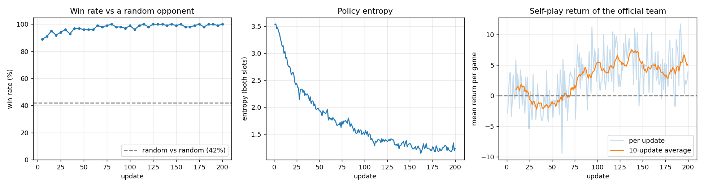
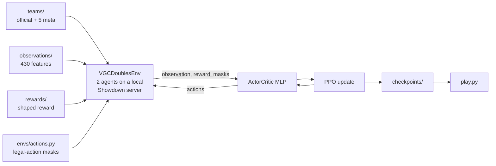

# poke-emo-bot


A reinforcement-learning agent that learns to play **Pokémon Showdown doubles (VGC)** by playing against itself.
The training algorithm, **PPO with GAE, is implemented from scratch in PyTorch** (no RL libraries), on top of
[poke-env](https://github.com/hsahovic/poke-env) and a local Showdown server.

No one tells the agent how to play: it only receives a score after every turn (damage dealt, Pokémon fainted,
a large bonus for winning) and improves a neural network to make the moves that lead to higher scores more likely.



## Results

Win rate of the agent playing the official team against an opponent that picks random legal moves:

| Agent | Win rate |
|---|---|
| Plays random legal moves too (500 games) | 47.0% |
| Untrained network, greedy (4 seeds, 200 games each) | 16% – 51% |
| **Trained network, greedy (500 games)** | **98.8%** |

- 200 PPO updates ≈ 26,000 self-play games (~410k decisions) in about 50 minutes on a laptop CPU, no GPU.
- The agent learns to stop wasting turns almost immediately (89% after 5 updates) and keeps sharpening its
  policy (entropy falls from 3.5 to 1.2). In self-play, the same network gets more out of the fixed official
  team than out of the meta teams as training goes on (right-hand chart).

**Honest caveat:** beating a random opponent is a low bar. It shows that the agent learned sensible play, not
that it is strong. I have not benchmarked it against human players or heuristic bots yet; see the
[roadmap](#limitations-and-roadmap).

## Technical highlights

- **PPO + GAE from scratch** in under 300 lines of PyTorch (`agents/`): actor-critic MLP (231k parameters), clipped objective,
  entropy bonus, advantage normalisation and gradient clipping. Checked against hand-computed examples.
- **Self-play with a shared network.** One network controls both sides of every battle. The agent always plays
  the same 6-Pokémon team against a pool of 5 rotating "meta" teams, so it cannot overfit to a single opponent.
- **Structured action space with legality masks.** Each of the two active Pokémon chooses among 107 actions
  (pass, 6 switches, 4 moves × 5 targets × gimmick variants), and most are illegal on any given turn. Masks remove
  them before sampling. The second Pokémon is sampled *conditionally on the first*, which enforces joint rules
  (no double switch to the same Pokémon, one mega evolution per turn): 0 illegal joint actions in 25 test games,
  versus at least one in more than half of the games I sampled with independent masks.
- **A 430-number observation that respects hidden information.** Own Pokémon use their exact stats; the
  opponent's use species base stats only; the opponent's bench only appears once revealed. It deliberately does not
  one-hot encode the species, so it describes *how a Pokémon is doing and what its moves can do* (HP, status,
  boosts, types, move power and type effectiveness against each opponent) instead of *who it is*.
- **Dense reward with a dominant win bonus** (HP and KO deltas per turn, ±30 for the result), rescaled for a
  stable critic.
- **Debugging a poke-env data gap.** poke-env 0.10.0 (the latest release) does not know the newest mega
  evolutions, which made battles hang when one triggered mid-game. The repo patches its Pokédex from the
  simulator's own data (`teams/pokedex_patch.py`).
- **Fast local simulation:** ~77 environment steps per second on one process.

## How it works



Each training update: (1) play whole self-play games until ≥ 2048 decisions are collected, (2) compute advantages
with GAE, (3) run 4 PPO epochs over minibatches, (4) every 5 updates evaluate against a random opponent and save
the weights. A step-by-step walkthrough with the maths is in
[`docs/como_funciona.md`](docs/como_funciona.md) (Spanish).

## Quickstart

Tested with Python 3.9 on macOS. The simulator needs `git` and Node.js ≥ 18.

```bash
git clone https://github.com/EmoMeza/poke-emo-bot.git
cd poke-emo-bot
python -m venv venv && source venv/bin/activate
pip install -r requirements.txt

bash scripts/setup_server.sh                              # installs the local Showdown server
cd pokemonshowdown-server && ./pokemon-showdown start     # leave this running (localhost:8000)
```

In another terminal (with the venv active):

```bash
python test_env.py            # smoke test: 3 games of random legal moves
python train.py               # train (~50 min for 200 updates); Ctrl+C to stop
tensorboard --logdir runs     # training curves at http://localhost:6006
python scripts/plot_training.py --run runs/<your-run>   # regenerate the chart above
```

### Play against the agent

```bash
python play.py                # loads checkpoints/pretrained.pt
```

Then open <http://localhost:8000>, pick any username, build or import a team for the
`gen9championsvgc2026regmc` format (any file in `teams/data/meta/` works) and challenge the bot:
`/challenge PokeEmoBot, gen9championsvgc2026regmc`. Use `--checkpoint` to load your own weights and
`--stochastic` to make the agent sample its moves instead of always choosing the most likely one.

## Repository structure

```
teams/           official and meta teams, team loading, poke-env Pokédex patch
observations/    battle → 430-number observation
rewards/         per-turn reward
envs/            action space, legality masks, and the self-play environment (VGCDoublesEnv)
agents/          actor-critic network, PPO, checkpoint saving/loading
scripts/         server setup and training-chart scripts
docs/            technical documentation and images
checkpoints/     pretrained.pt (published weights)
train.py         self-play training loop
play.py          play against a trained agent from the browser
test_env.py      environment smoke test
```

## Limitations and roadmap

- **Team preview is random.** poke-env picks which 4 of the 6 Pokémon to bring, and the agent does not learn it yet.
  Options: a type-matchup heuristic, a table measured from self-play, or a learned selection policy.
- **Evaluation saturates.** Against a random opponent the win rate hits ~99% quickly, so it cannot show further
  progress. Next: evaluate against earlier checkpoints and a scripted damage-maximising bot.
- **No memory.** The MLP only sees the current state, so it forgets which moves and items the opponent has already
  revealed. A recurrent network or extra features would address it.
- **Pure self-play can cycle.** Mixing in older checkpoints as opponents would make training more robust.
- **Mega evolution only.** Z-moves, Dynamax and Terastallization exist in the action space but are always masked in
  this format.

## Credits and disclaimer

Built on [Pokémon Showdown](https://github.com/smogon/pokemon-showdown),
[poke-env](https://github.com/hsahovic/poke-env), [PyTorch](https://pytorch.org/),
[Gymnasium](https://gymnasium.farama.org/) and [PettingZoo](https://pettingzoo.farama.org/).

This is an unofficial fan project for educational purposes. It is not affiliated with or endorsed by Nintendo,
Game Freak, Creatures Inc. or The Pokémon Company. Pokémon and related names are trademarks of their respective owners.

## License

[MIT](LICENSE)
